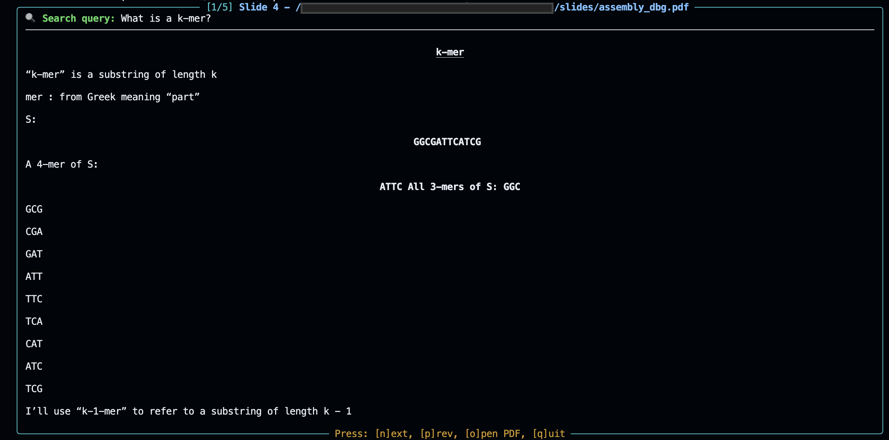

# PDF Semantic Search Tool

A command-line tool for searching through PDF documents using semantic search capabilities. This tool allows you to find relevant content across your PDF files using natural language queries, powered by HuggingFace embeddings and Chroma vector database.

## Features

- 🔍 Semantic search across PDF documents
- 📄 Interactive slide viewer for search results
- 🎯 Configurable search parameters
- 📊 Rich terminal interface with markdown support
- 🔄 Persistent vector database for fast searches
- 📱 PDF preview integration (macOS)

## Screenshot

Running the tool in interactive mode with a search query "What is a k-mer?":



## Installation

1. Clone the repository:
```bash
git clone https://github.com/Asaad47/pdf_search.git
cd pdf_search
```

2. Install the required dependencies:
```bash
pip install -r requirements.txt
```

## Configuration

The tool uses a `config.yaml` file for configuration. Here's the default structure:

```yaml
pdf_paths:
  - "/path/to/pdf1.pdf"
  - "/path/to/pdf2.pdf"
  - "/path/to/pdf3.pdf"
chroma_dir: "./chroma_db"
default_query: "What is Machine Learning?"
default_k_results: 5
```

You can change the `pdf_paths` to your own PDF files.


## Usage

### 1. Creating the Search Database

Before searching, you need to create the vector database from your PDF files:

```bash
python create_db.py
```

### 2. Searching Documents

Basic search:
```bash
python search.py "your search query" -i
```

Advanced options:
```bash
python search.py "your search query" -k 10 -i
```

Command-line arguments:
- `-k`: Number of results to return (default: 5)
- `-v`: Verbose output mode (only if non-interactive)
- `-i`: Interactive mode with slide viewer

### Interactive Mode

When using interactive mode (`-i` flag), you can:
- Press `n` to view next result
- Press `p` to view previous result
- Press `o` to open the PDF in Preview (macOS)
- Press `q` to quit

## Example Usage

1. Create the database:
```bash
python create_db.py
```

2. Search with default settings:
```bash
python search.py "machine learning applications" -i
```

3. Search with custom settings:
```bash
python search.py "neural networks" -k 10 -i
```

## Project Structure

- `search.py`: Main search script
- `create_db.py`: Database creation script
- `config.yaml`: Configuration file
- `requirements.txt`: Python dependencies
- `chroma_db/`: Vector database directory
- `search.sh`: Shell script wrapper

## Notes

- The tool uses the `all-MiniLM-L6-v2` model from HuggingFace for embeddings
- PDF preview functionality is currently limited to macOS
- The vector database is persistent and stored in the `chroma_db` directory

## LLM Usage

The development of this project was done with the help of ChatGPT 4o and Cursor IDE Agentic mode.

## License

This project is licensed under the GNU Affero General Public License v3.0 (AGPL-3.0). See the [LICENSE](LICENSE) file for details.

Note: This project uses PyMuPDF which is also licensed under AGPL-3.0. Any modifications to this code must be open source and distributed under the same license. 